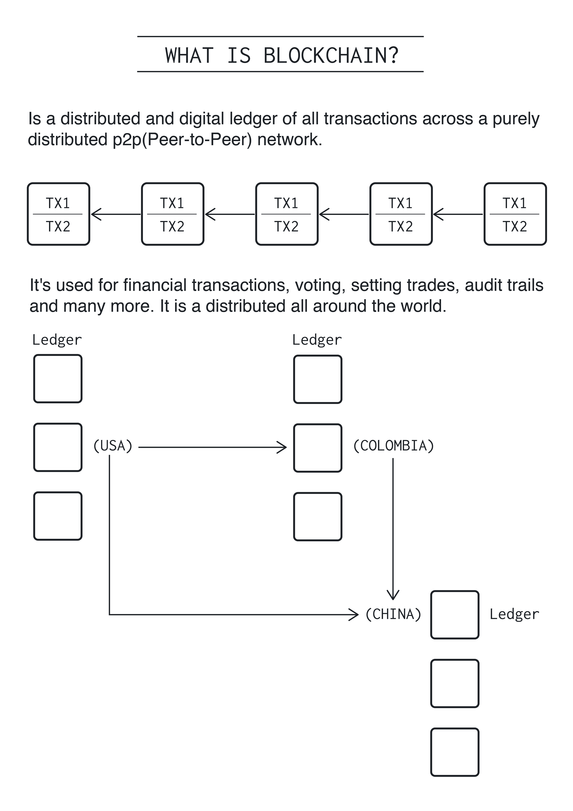
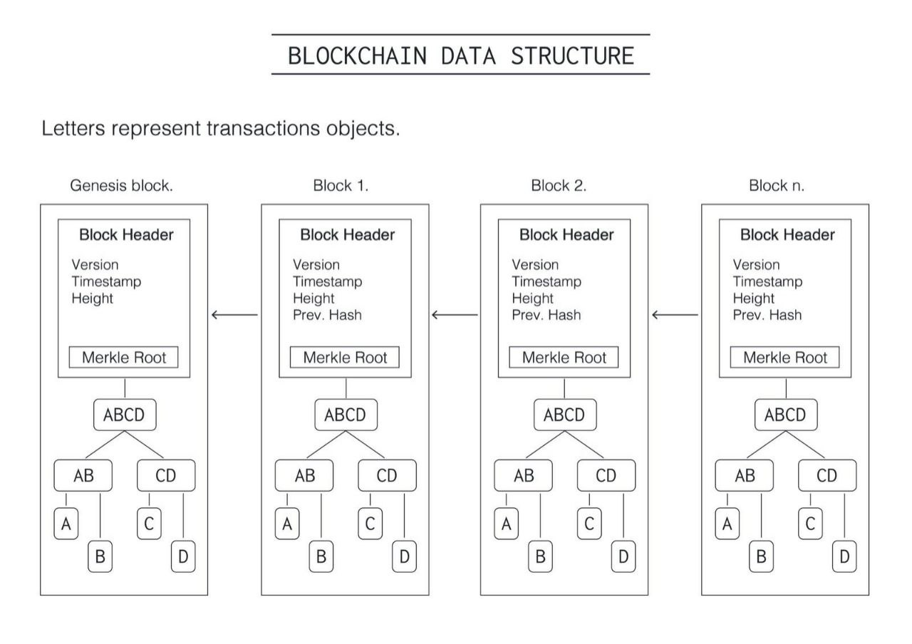
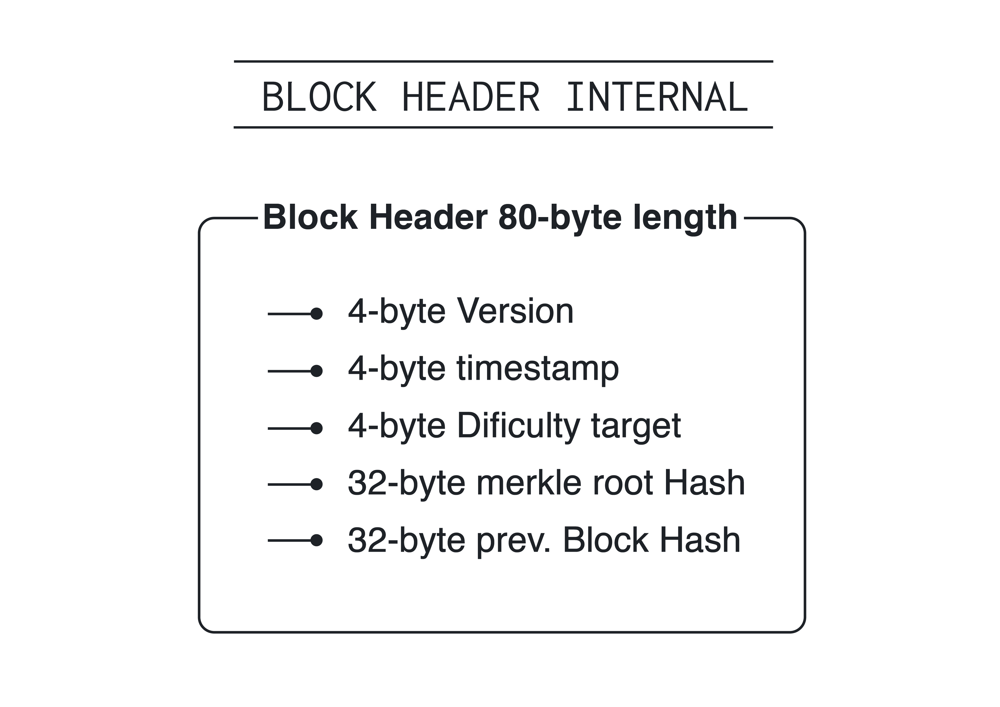

+++
title = "What is Blockchain?"
tags = [
    "Blockchain",
    "Blockchains",
    "Blockchain Header",
    "Blockchain Data Structure"
]
bounty = 5
date = "2018-01-03"
categories = [
    "What is Blockchain",
]
+++

Before going forward i do must say that bitcoin and blockchain are two diffrent technologies, bitcoin is a digital coin or cryptocurrency and a blockchain is a digital, distributed and decentralized ledger or database, that records an incrising number of transaction of ownerships. Bitcoin, ethereum and others cryptocurrencies use the blockchain as its storage. What does decentralized database mean? Slow down, first you need to understand what a centralized database is.

In this world that we live everyday, there exists organizations, startups and governments, each of them control a big amount of data stored at a single specific place in the planet and they use it to give us a service, by example: Google, facebook, Airbnb, Uber, BBVA, Amazon, United State of America government and others, only them can read, add, update and delete their data from their storage also called centralized database, but what happen if someone try to get into their databases, that  person could manipulate information, steal money and even fake an user identity to do criminal stuff, hence, those companies, startups and organizations spend a lot of money to prevent that situation.

The blockchain does not belong to anyone and it is not placed into a single place which mean could be around the world within a bunch of computers or nodes connected with each one another, creating a network.

Now, you might be asking, why this new database is revolutionizing the world of technology? Well, let me put it simple, each node has a copy of the record and it is updating it independently, between nodes need to reach an agreement to choose the new master copy, once done all nodes will replace their copy with the updated one, why is so great then? No a single node control the information (it can not delete, update or add without permission of others nodes) and each one of them need to be agree to use the new copy of the record, making the system really hard to break and manipulate which mean if someone try to change information, need to get 51% of the nodes on the network and manipulate transactions. By the way, this attack really exists, it is called '51% attack' and each existing blockchain could suffer it.

There exists two kind of blockchain: Public and Permissioned, what is the difference between both?

Public blockchain means, that anyone can read and update the chain and anyone at any moment can join the network putting a node online to start to do legitimate changes and add new data into the it.  Does it sound familiar? Yeah, it sounds like bitcoin's blockchain, if you go to https://blockchain.info/ site you can verify each new transaction added to a blockchain's block and also you can put a new node online a join the network.

By permissioned blockchain i mean that for anyone to read, add data or even put a node online, need special permissions, but where do you get this permissions?, by talking to its owner. By example, Ripple runs a permissioned blockchain. If you want to read transactions or join the network, first you need to talk to Ripple startup.

Very cool haa!, but how is structured this blockchain? transactions or files are added into blocks, each one of them connected with one another with cryptography encryption forming a linked-list or chain of blocks using complex mathematical algorithms, how is that? each block is connected with the last one created by a hash (SHA256) reference and so on until you reach the first created block also called genesis block, as follow.

What the different between that block and the others? It is the first block created, the block 0 and has not a previous block because there isn't any.

Each block contains a 80-byte length block header which contains the following fields: version, timestamp, height, previous hash, merkle root hash.

The version field, it is the current block's version.
The timestamp field, it is the time in Unix format when the block was created.
The Height field, it is the block's height within the blockchain.
The previous hash field, it is a reference to the previous block added to the blockchain.
The root hash field, it is a reference to current block's transactions, a blockchain uses the merkle algorithm to add transactions to a block https://en.wikipedia.org/wiki/Merkle_tree.

Thanks to this block header each blockchain’s node can check if a block is valid, how does that work? Well, there exists a couple of checks a node do.

	1. A node should check if the current block timestamp and height is greater than last block added,
	2. it should check if it use a correct and supported version,
	3. it should check if previous hash is correct, by example, if does not point to another block that does not exists at the master copy,
	4. it should check if root hash is correct, calculating block hash to compare both hashes and verify if they are equal.

If the block pass this checks, it'll be appended to the blockchain at all nodes over the network.